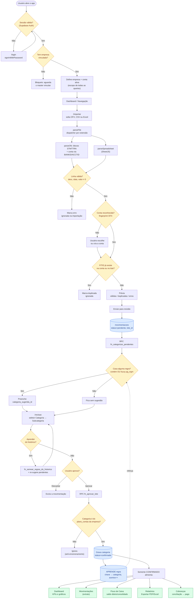
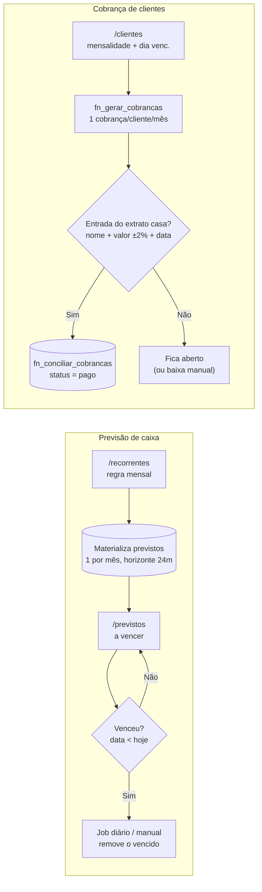

# Zaytan Hub Financeiro — Análise de Estrutura e Fluxograma

> Análise do projeto na pasta `Zaytan Finance Hub`. Stack: **TanStack Start (React 19, SSR) + TanStack Router + TanStack Query + Supabase (Postgres, Auth, RLS e funções RPC) + Tailwind/Radix + Recharts**, com exportação via `jspdf` e `xlsx`.

## 1. Breve Resumo

O Zaytan Hub é um painel financeiro **multiempresa** cujo coração é um ciclo de **"extrato + IA": Importar → Revisar → Aprovar → (aprender) → Relatar**. O usuário faz login (Supabase Auth) e opera sempre dentro de uma **empresa ativa** e, opcionalmente, de uma **conta bancária ativa** — esse escopo filtra todas as consultas. Ele importa extratos (OFX, CSV ou Excel); o parser interpreta cada linha, reconhece a conta bancária pelo próprio arquivo (no OFX, via `BANKID/ACCTID`) e descarta duplicatas pelo `FITID`. As transações entram no banco como **`pendente`** e uma função no Postgres (`fn_categorizar_pendentes`) já sugere a categoria casando a descrição normalizada contra regras aprendidas (por "contém" ou similaridade *fuzzy*). Na tela de **Revisão**, o usuário aceita/corrige e **aprova**; a aprovação grava a transação como **`confirmada`** e, no mesmo passo, **aprende uma regra** (estabelecimento → categoria), retroalimentando as sugestões futuras. Só o que está **confirmado** alimenta Dashboard, Movimentações, Fluxo de Caixa, Relatórios e a conciliação de cobranças de clientes. Em paralelo rodam três subsistemas de apoio: **Planejamento** (previsto × realizado), **Recorrentes → Previstos** (previsão de caixa materializada mês a mês) e **Clientes → Cobranças** (mensalidades conciliadas automaticamente contra as entradas do extrato).

## 2. Arquitetura do Fluxo

### Pontos de entrada (inputs)
- **Autenticação** (`/login`, `src/lib/auth.tsx`): e-mail/senha via `supabase.auth.signInWithPassword`.
- **Seleção de empresa/conta** (`src/lib/empresa.tsx`): define `empresaId` e `contaId` (referências de módulo lidas por todas as queries).
- **Importação de arquivos** (`/importar` + `src/lib/import-parsers.ts`): OFX, CSV ou Excel — o input primário de dados financeiros.
- **Cadastros manuais**: clientes, plano de contas, recorrentes, previstos, planejamento, regras de categorização (telas em `src/routes/*`).

### Processamento de dados
- **Parsing** (`parseFile`): dispatcher por extensão → `parseOfx` (blocos `<STMTTRN>` + cabeçalho da conta) ou `parseSpreadsheet` (SheetJS). Normaliza data, valor (formato BR), tipo (`in`/`out`) e descrição.
- **Persistência + pré-categorização** (`useImportLote` → RPC `fn_categorizar_pendentes`): grava o lote como `pendente` e preenche apenas `categoria_sugerida_id`.
- **Aprovação + aprendizado** (RPC `fn_aprovar_lote`): confirma a transação e faz *upsert* da regra aprendida (incrementa `acertos`).
- **Cálculo de saldo** (`src/lib/saldo.ts`): série diária acumulada por conta e **consolidado** entre contas (cada conta só conta a partir da sua data de abertura).
- **Conciliações**: OFX↔movimentações (dedup por `FITID`) e cobranças↔entradas (`fn_conciliar_cobrancas`).

### Tomada de decisão (condicionais)
1. **Sessão válida?** → senão, `/login`.
2. **Empresa vinculada?** → senão, bloqueio "sem empresa".
3. **Linha válida?** (descrição, data e valor ≠ 0) → senão, marca erro.
4. **Conta bancária reconhecida?** (fingerprint OFX) → senão, passo "atribuir/criar conta".
5. **`FITID` já existe** na conta ou no lote? → se sim, marca duplicada (ignora).
6. **Casa alguma regra?** (contém **ou** *fuzzy* `pg_trgm ≥ 0.5`) → preenche sugestão ou fica sem sugestão.
7. **Usuário aprova / descarta / aprende do histórico?**
8. **Categoria pertence ao `plano_contas` da empresa?** (anti-envenenamento) → senão, ignora a aprovação.
9. **Previsto venceu?** / **entrada casa com cobrança?** (nos subsistemas de apoio).

### Saídas (outputs)
- **Dashboard** (`/`): KPIs, gráficos (saldo, evolução, pizza por categoria, receitas × despesas), previsto × realizado.
- **Movimentações** (`/movimentacoes`): extrato confirmado (editar, excluir, recategorizar em lote).
- **Fluxo de Caixa** (`/fluxo-caixa`): saldo diário/consolidado.
- **Relatórios** (`/relatorios`): mensal/anual/por categoria → **Exportar PDF/Excel** (`src/lib/export.ts`).
- **Cobranças** (`/clientes`): status pago/aberto conciliado com o extrato.
- **Regras aprendidas** (`regras_categorizacao`): retroalimentam a etapa de sugestão.

> Regra de ouro: **somente `categoria_status = 'confirmada'`** entra em extrato, saldo e relatórios. Enquanto `pendente`, a transação vive apenas na tela de Revisão.

## 3. Código do Fluxograma (Mermaid.js)

### 3.1 Fluxo principal — Importar → Revisar → Aprovar → Relatar (com o laço de aprendizado)

### 3.2 Subsistemas de apoio — Previsão de caixa e Cobrança de clientes

## 4. Passo a Passo Textual (caminhos possíveis)

**Caminho feliz (importação OFX que o sistema já conhece):**
Login → empresa ativa resolvida → `/importar` → arraste um `.ofx` → `parseOfx` lê transações e a conta (fingerprint) → conta **reconhecida** automaticamente → nenhum `FITID` repetido → prévia → "Enviar para revisão" → grava como `pendente` e `fn_categorizar_pendentes` **sugere** as categorias → `/revisao` mostra tudo com o *badge* "Sugerida" → "Aprovar todas" → `fn_aprovar_lote` **confirma** e **aprende** as regras → as transações somem da Revisão e aparecem em Movimentações/Dashboard/Fluxo de Caixa.

**Desvios de decisão no import:**
- *Conta não reconhecida* (CSV/Excel, ou OFX de banco ainda não cadastrado) → passo **"atribuir conta"**: escolher uma conta ativa ou **criar** a partir dos metadados do OFX; só então segue para dedup.
- *Linha inválida* (sem descrição, data ilegível ou valor 0) → marcada como **erro** e ignorada no envio (aparece na prévia como "com erro").
- *`FITID` duplicado* (já importado naquela conta, ou repetido dentro do próprio lote) → marcado **"já importada"** e ignorado — evita lançar a mesma transação duas vezes.

**Laço de aprendizado (o "IA" do projeto):**
Cada **aprovação** extrai a "chave do estabelecimento" (1ª palavra significativa da descrição normalizada — ex.: `PAG*Uber 072025` → `UBER`) e grava/atualiza uma regra `chave → categoria`. Na próxima importação, `fn_categorizar_pendentes` casa novas descrições contra essas regras por **"contém"** ou **similaridade fuzzy** (`pg_trgm`, limiar 0,5), priorizando: regra da empresa > regra global; "contém" exato > *fuzzy*; maior nº de `acertos`; mais recente. O botão **"Aprender do histórico"** faz o *cold-start*: cria regras a partir das transações já confirmadas (com filtro de qualidade: chave ≥ 4 letras, ≥ 2 ocorrências, ≥ 70% numa mesma categoria) e re-sugere os pendentes.

**Salvaguardas na aprovação (por que `fn_aprovar_lote` pode "pular" um item):**
Item sem categoria escolhida é ignorado; a transação precisa continuar `pendente` (proteção contra clique-duplo/concorrência — TOCTOU); e a categoria escolhida **tem de pertencer ao `plano_contas` da própria empresa** — caso contrário a aprovação é descartada, evitando gravar transação confirmada sem categoria e "envenenar" o aprendizado com uma regra de outra empresa.

**Subsistema Recorrentes → Previstos:** uma recorrência mensal materializa vários `previstos` (um por mês; recorrências sem prazo mantêm ~24 meses à frente). Previstos vencidos (`data < hoje`) são removidos por um job diário do `pg_cron` (e sob demanda ao abrir a tela). Servem à visão **previsto × realizado** do Dashboard/Planejamento.

**Subsistema Clientes → Cobranças:** ao abrir `/clientes`, `fn_gerar_cobrancas` materializa uma cobrança por cliente/mês e `fn_conciliar_cobrancas` tenta casar cada cobrança **aberta** com uma entrada **confirmada** do extrato por **nome** (chave normalizada, "contém") + **valor** (dentro de ~2% ou R$ 2) + **data** (janela em torno da competência), sem reutilizar a mesma entrada duas vezes. Casou → marca **pago**; não casou → segue **aberto** (ou baixa manual).

---

### Anexo — Mapa de arquivos-chave

| Camada | Arquivo | Papel |
|---|---|---|
| Raiz/Providers | `src/routes/__root.tsx` | Query + Theme + Auth + Empresa; remonta a árvore por empresa |
| Auth | `src/lib/auth.tsx` | Sessão Supabase, `signIn`/`signOut` |
| Multiempresa | `src/lib/empresa.tsx` | Empresa/conta ativa, `isMaster`, cache por empresa |
| Parsing | `src/lib/import-parsers.ts` | `parseOfx` / `parseSpreadsheet` / `parseFile` |
| Dados/RPC | `src/lib/queries.ts` | Todos os hooks TanStack Query + chamadas RPC |
| Saldo | `src/lib/saldo.ts` | Série diária e consolidação entre contas |
| Import UI | `src/routes/importar.tsx` | Dropzone, atribuição de conta, dedup, prévia |
| Revisão UI | `src/routes/revisao.tsx` | Seletor de categoria, aprovar/descartar/aprender |
| Backend IA | `supabase/16_funcoes_categorizacao.sql`, `17_fuzzy_match.sql` | `fn_categorizar_pendentes`, `fn_aprovar_lote`, normalização/fuzzy |
| Cobranças | `supabase/22_cobrancas_clientes.sql` | `fn_gerar_cobrancas`, `fn_conciliar_cobrancas` |
